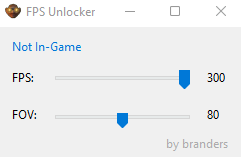

# MW2 FPS and FOV Unlocker :unlock:

Tool for changing the max fps and fov for mw2 because they do not provide it.

1. Download the exe file from releases: [https://github.com/andersblomqvist/mw2-fps-unlocker/releases/tag/1.0](https://github.com/andersblomqvist/mw2-fps-unlocker/releases/tag/1.0)
2. Start FPS Unlocker
3. Start MW2 through steam
4. Change sliders to your preference

## Screenshot

## Notes

No recorded vac-bans. If you close MW2, you have to restart the fps unlocker aswell.
